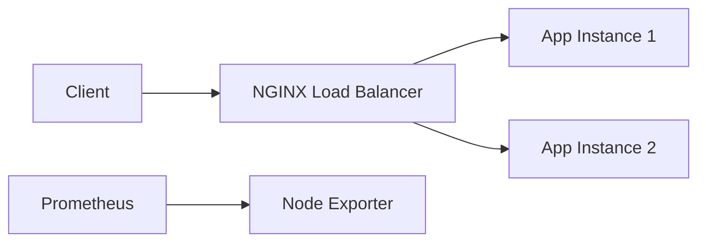

# High-Availability Hosting Lab

A hands-on infrastructure engineering lab for running a small service with redundancy, health checks, load balancing, monitoring, container isolation, automated testing, and controlled failover.

The project is intentionally infrastructure-first. The application is small so the focus stays on the systems around it: how traffic is routed, how failures are detected, how service continuity is tested, and how operators can observe the environment.

## Portfolio demo

The repository includes an interactive Windows-style **Reliability Console** in `mock-app/`. It is a presentation layer for a portfolio and demonstrates the operational story visually without pretending to be a production control plane.

```bash
python -m http.server 8000 --directory mock-app
# open http://localhost:8000
```

Use **Simulate node failure** to take `app-01` out of service in the UI and show how traffic remains available through the second instance. The real Docker lab includes a separate failover script that exercises the running containers.

## Architecture



## What this demonstrates

- Two independent application instances behind NGINX
- Least-connections load balancing
- Health checks and container restart policies
- Controlled failure simulation and recovery
- Prometheus and Node Exporter monitoring
- Non-root application container execution
- GitHub Actions validation
- A portfolio-ready operational dashboard

## Run the infrastructure lab

Requirements: Docker with Docker Compose.

```bash
docker compose up --build -d
curl http://localhost:8080/
```

Prometheus is available at `http://localhost:9090`.

To stop the environment:

```bash
docker compose down
```

## Exercise failover

```bash
chmod +x scripts/failover_test.sh
./scripts/failover_test.sh
```

The script stops one application instance, sends requests through NGINX to verify that the remaining instance continues serving traffic, then restores the stopped instance.

## Reliability and security decisions

The application container runs as a non-root user. Health checks reduce the chance of routing traffic to services that are not ready. Restart policies provide basic process recovery. Reverse proxy, application, and monitoring responsibilities are separated into different services so each component can be inspected and changed independently.

This lab demonstrates local redundancy, not geographic disaster recovery. A production healthcare hosting design would also require multi-zone or multi-site deployment, TLS, centralized logging, protected secret storage, vulnerability scanning, network controls, backup and restore validation, alert routing, change control, and formal incident procedures.

## Repository layout

```text
app/                  Python service and container image
nginx/                Reverse proxy and load-balancing configuration
prometheus/           Monitoring configuration
scripts/              Failover exercise
mock-app/             Interactive portfolio presentation
.github/workflows/    CI pipeline
tests/                Automated health tests
```

## Skills demonstrated

`Linux` `Docker` `NGINX` `High Availability` `Health Checks` `Prometheus` `Python` `CI/CD` `Failover Testing` `Reliability Engineering`

## Why I built it

Enterprise infrastructure engineering is largely about making failures predictable, observable, and recoverable. This project gives me a small environment where I can demonstrate those principles directly instead of only describing them on a resume.
